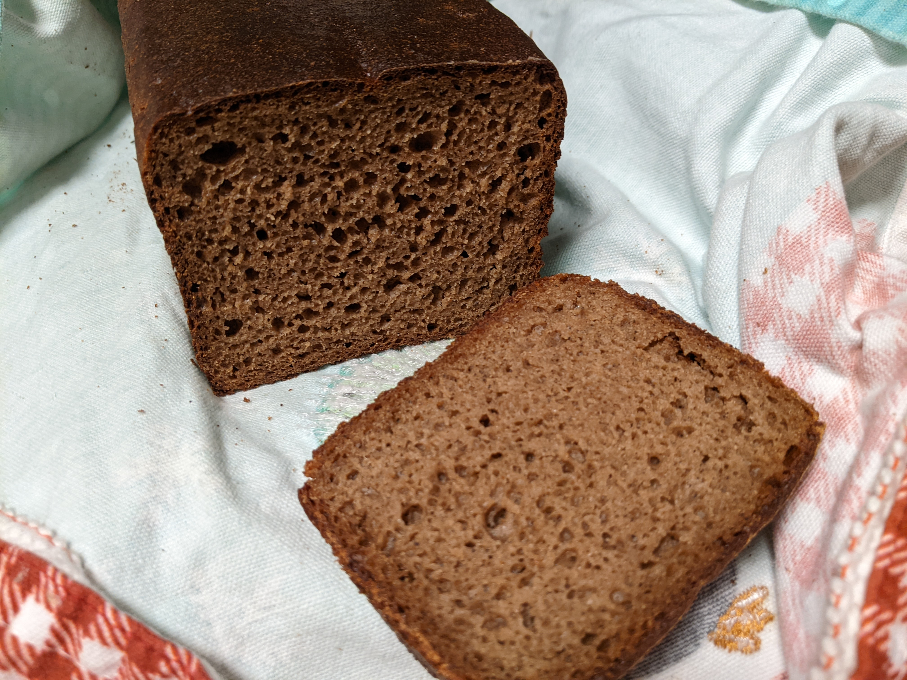

[назад в оглавление](../content.md)

# Чисто ржаной хлеб с солодом

Рецепт получения ароматного ржаного хлеба с использованием только ржаной муки и
фермертированного ржаного солода.

**Вывод ржаной закваски**

Ржаную закваску можно вывести из пшеничной, используя пшеничную на начальном этапе.
Использую закваску 150% влажности - более жидкую закваску легче смешивать.

Для кормления закваски:
- Вода 30 гр.
- Старая закваска 5 гр. 
- Мука ржаная 20 гр.

Процесс кормления закваски:
1. В чистой посуде (я использую банку 1 л.), добавить воду, старую закваску, тщательно перемешать.
2. Добавить муку, тщательно перемешать, осадить смесь со стенок.
3. Закрыть посуду фольгой. Сделать несколько отверстий, чтобы закваска дышала.
4. Поставить в духовку со включенной подсветкой (температура 40 С).
5. Закваска готова для следующего цикла после удвоения объёма.

Для вывода новой закваски повторить цикл кормления 3 раза. После этого можно использовать для выпечки
или хранить в холодильнике.

**Оживление закваски**

Если закваска из холодильника, ставим оживлять с вечера. Для это используем один цикл кормления.
Закваска из холодильника менее активна, поэтому подниматься будет всю ночь.

**Закваска**

- Вода 150 гр.
- Закваска 55 гр. 
- Мука ржаная 100 гр.

1. Добавить воду к закваске, тщательно перемешать.
2. Добавить муку, тщательно перемешать.
3. Закрыть посуду фольгой. Сделать несколько отверстий, чтобы закваска дышала.
4. Поставить в духовку со включенной подсветкой (температура 40 С).
5. Готово когда удвоит объём (~4-5 часов)

Для опары используем 250 гр. закваски. Остаток ставим в холодильник. Закваска может храниться
несколько недель без подкормки.

**Опара**

- Вода 295 гр.
- Закваска 250 гр.
- Ржаная мука 275 гр.

1. В большой посуде смешать воду с закваской. Удобно использовать венчик для взбивания.
2. Добавить муку, тщательно перемешать.
3. Выровнять поверхность.
4. Закрыть крышкой или плёнкой.
5. Поставить в духовку со включенной подсветкой (температура 40 С).
6. Готово, когда пузырьки начнут выходить на поверхность. Объём к этому времени должен
увеличиться в два раза. (~3-4 часа)

**Специи**

- Ржаной ферментированный солод 10 гр.
- Семена тмина 2 гр. (по вкусу, не обязательно)
- Соль 1.5 ч.л.
- Мёд 1 ст.л.

1. Солод залить 30 гр. кипятка.
2. Добавить семена тмина по желанию.
3. Добавить соль, мёд, тмин, перемешать.
4. Настаивать при комнатной температуре до готовности опары.

**Тесто**

- Вся опара
- Масло подсолнечное 2 ст.л.
- Специи
- Ржаная мука 200 гр.

1. Добавить к опаре специи, масло, тщательно перемешать.
2. Добавить муку, замесить тесто (удобно использовать смоченную водой силиконовую лопатку).
3. Выровнять верх теста.
4. Закрыть крышкой, поставить в духовку (40 С) на 1 час.
5. Обжать тесто, чтобы выпустить газ.
6. Перегрузить в форму. Придать крыше гладкую округлую форму. На практике более округлая форма помогает крыше не проваливаться.
7. Накрыть пакетом, поставить в духовку (40 С) на 1 час. Важно к концу этапа чтобы духовка была уже разогрета до 500 F.

**Выпечка**

1. 500 F 5 мин. (обжарка)
2. 395 F 55 мин. или 425 F 45 мин.
3. Для получения глянцевого верха, опрыскать верх хлеба водой за 10 минут до окончания выпечки.
4. Для получения хрустящей корочки, после выпечки приоткрыть духовку и оставить на 5 минут.
5. После выпечки завернуть в полотенце и поставить на решетку на несколько часов для стабилизации мякиша.

**Коррекция**

- 'оторвалась крыша' - не дал подойти перед выпечкой
- 'плоская крыша' - перестоял перед выпечкой

**Временная таблица**

| Этап                | Начало | Длительность (часов) |
|---------------------|--------|----------------------|
| Раскормка закваски  |  21:00 | 8                    |
| Закваска            |   5:00 | 4                    |
| Опара               |   9:00 | 3                    |
| Тесто               |  12:00 | 1                    |
| Расстойка в форме   |  13:00 | 1                    |
| Выпечка             |  14:00 | 1                    |
| Стабилизация мякиша |  15:00 | 2 и больше           |
