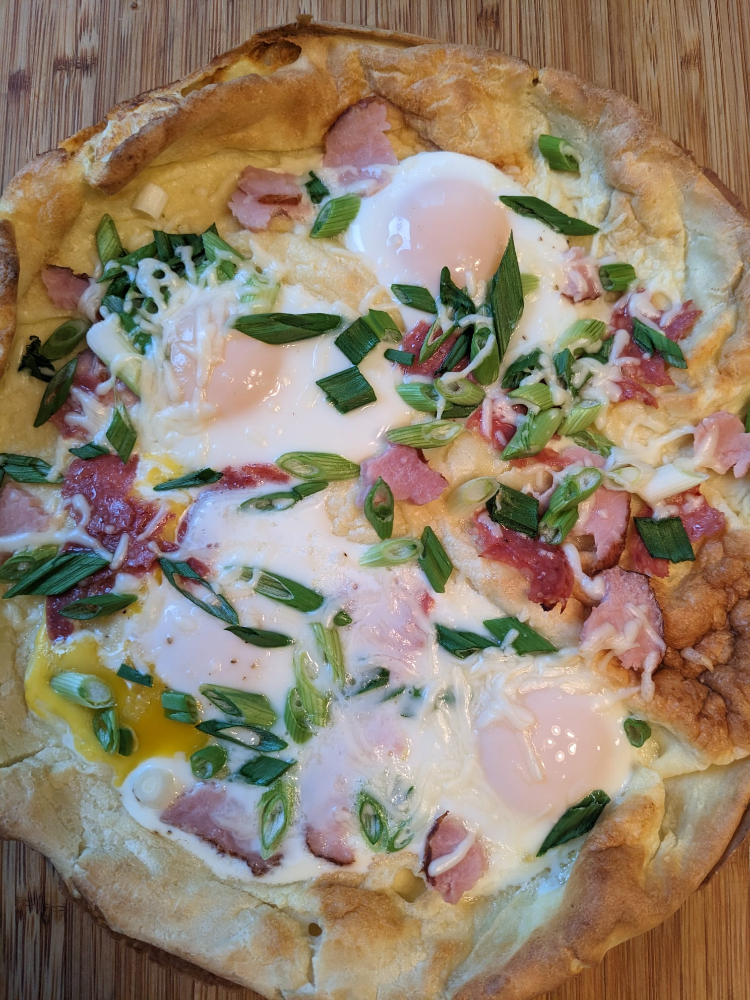

[назад в оглавление](../README.md)
# Датч бэби

**Ингридиенты**
* Тесто
  * яйца - 3 шт
  * сахар - 3 ч.л.
  * соль - по вкусу ~1/2 ч.л.
  * мука - 2/3 стаканa
  * кукурузный крахмал - 1/3 стакана
  * молоко - 1 стакан
  * по желанию, мягкий сыр типа рикотта или филадельфия - 2 ст.л.
  * сливочное масло для жарки 1 ст.л.
* Начинка 
  * яйца - 4 шт
  * зелёный лук - 3 стебля
  * по желанию - всё что положил бы на пиццу
    * салями
    * ветчина
    * моццарелла

**Процесс**
* Тесто
  * положить яйца на 5 мин в тёплую воду, чтоб были комнатной температуры.
  * подогреть молоко до тёплого
  * 3 яйца, соль взбить до желтого оттенка
  * добавить крахмал, муку, мягкий сыр, перемешать до однородности
  * добавить молоко, перемешать до однородности
* Духовка на 425F, non-stick сковородку внутрь. Когда нагреется - вытаскиваем сковородку и мажем её щедро маслом
* Выливаем тесто на сковороду и в духовку минут на 15-20, до почти полной готовности (золотистая корочка)
* Тем временем:
  * 4 яйца не повреждая желтка разбить в тарелку, посолить, посыпать перцем по вкусу
  * порезать зелёный лук
  * подготовить остальную начинку
* На почти готовый блин вылить яйца из тарелки, высыпать лук и приготовленную начинку
* Допечь до желаемой готовности яиц. В оригинале - жидкий желток.
